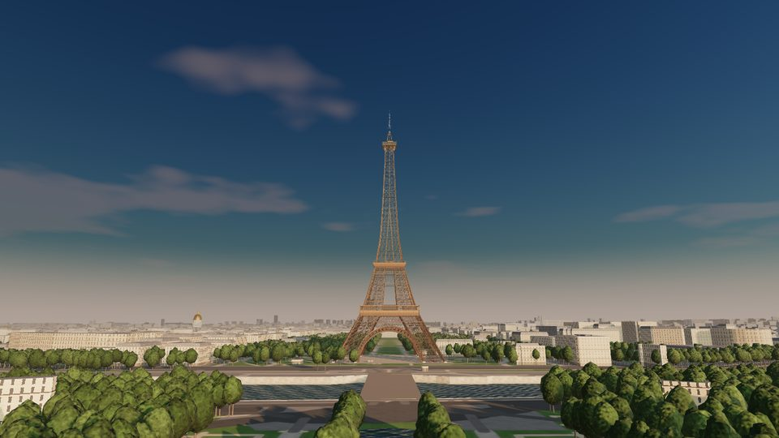
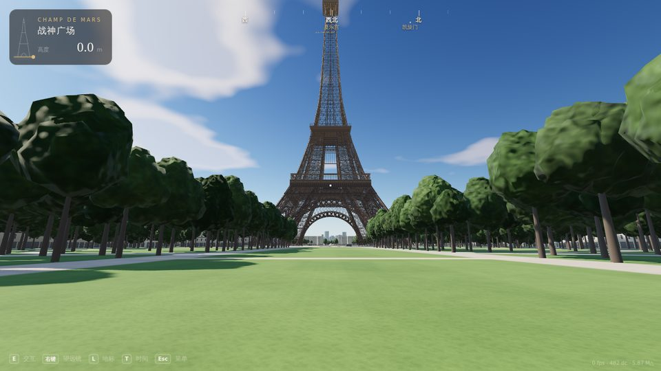
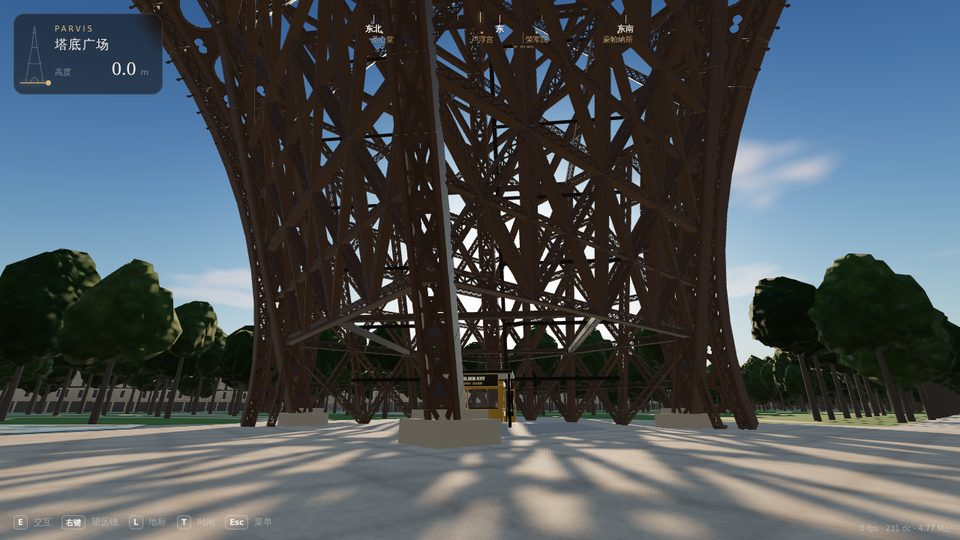
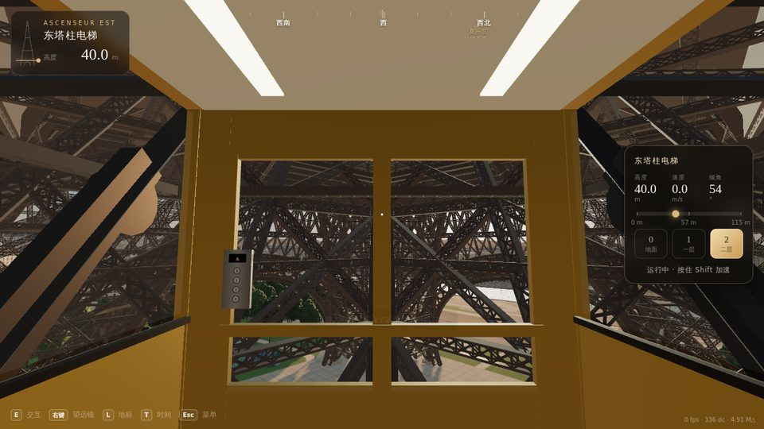
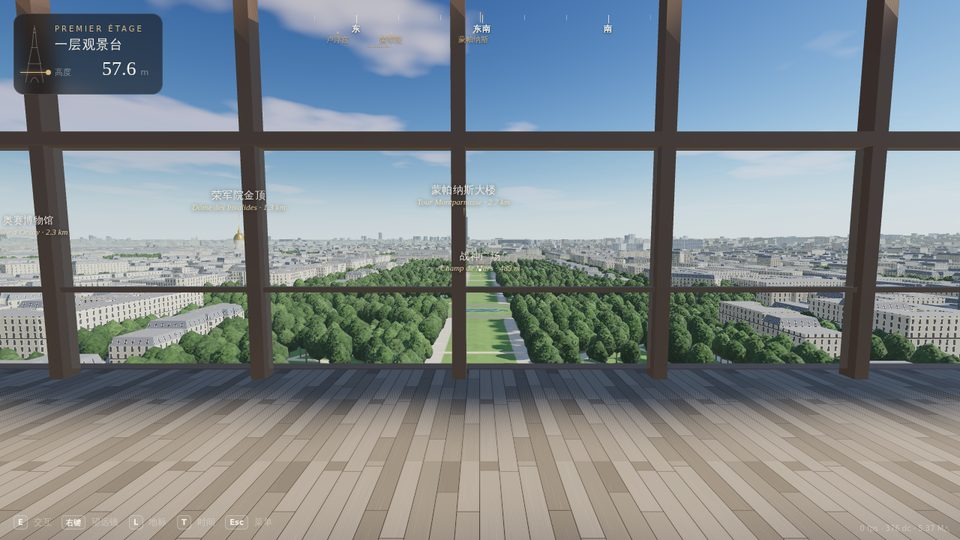
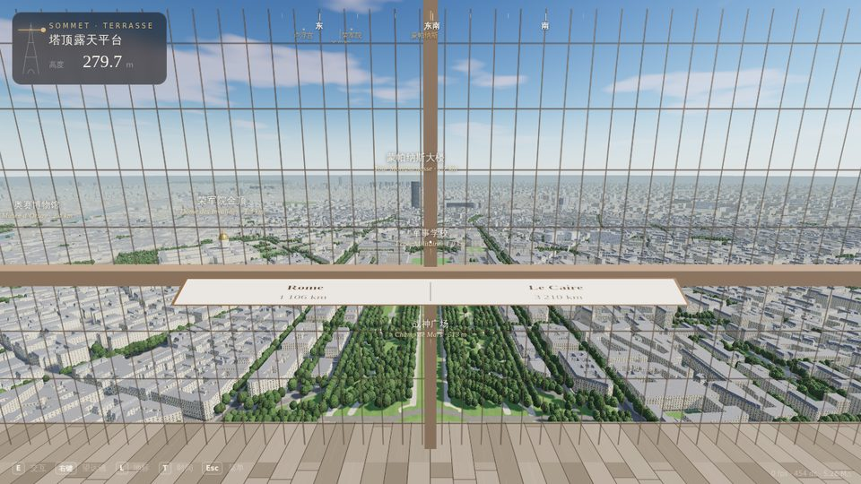
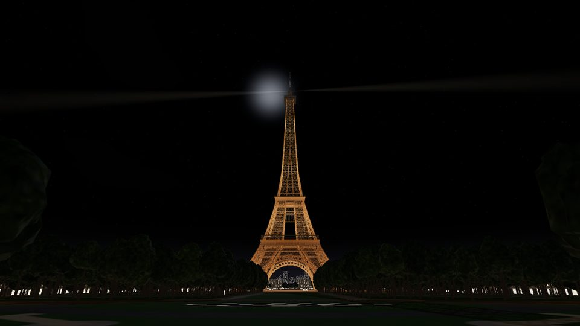

# La Tour Eiffel · 埃菲尔铁塔第一人称 3D 观景

按 1:1 真实尺寸程序化生成的埃菲尔铁塔，周边是来自 OpenStreetMap 的真实巴黎街区。可以在塔下广场和战神广场自由行走，乘东、西塔柱的斜行电梯上一层、二层，再换乘直达电梯登顶俯瞰全城。

**直接用浏览器打开 `index.html` 就能玩**：单个文件约 1.5 MB，three.js 和地图数据都已内嵌，不需要联网，也不需要本地服务器。



| | |
|---|---|
|  |  |
| 战神广场（出生点） | 塔下广场，东塔柱电梯站 |
|  |  |
| 东塔柱斜行电梯轿厢内 | 一层回廊，57.6 m |
|  |  |
| 塔顶露天平台，279.7 m | 夜间金色照明与探照灯 |

## 操作

| 键盘 / 鼠标 | 功能 | 触屏 |
|---|---|---|
| `W A S D` | 行走 | 左半屏拖动 |
| 鼠标 | 环视（点击画面锁定指针） | 右半屏拖动 |
| `Shift` | 快步；乘电梯时按住可 3 倍速运行 | 「快步」 |
| `空格` | 跳 | 「跳」 |
| `E` | 在站台呼叫电梯；在轿厢内前往下一站 | 「乘梯」 |
| `0` `1` `2` `3` | 在轿厢内选择楼层（也可以点右侧面板） | 点面板 |
| 鼠标右键（按住） | 望远镜，塔顶护网会自动淡出 | 「望远」 |
| `L` | 显示 / 隐藏地标标注 | 「地标」 |
| `T` | 切换时间：清晨 → 午后 → 黄昏 → 夜晚 | 菜单 |
| `H` | 隐藏界面 | |
| `Esc` | 暂停 / 菜单 | 「菜单」 |

开始菜单里可以选时间、画质（流畅 / 均衡 / 高清 / 极致）和起点（战神广场 / 塔下 / 一层 / 二层 / 塔顶）。也可以用地址参数直接指定，例如 `index.html?time=golden&quality=high&spawn=top`。

## 需求对照

### 1. 真实比例复刻

| | 模型 | 实物 |
|---|---|---|
| 总高（含天线） | 330 m | 330 m |
| 铁结构顶 | 300.5 m | 约 300 m |
| 底座 | 塔腿外缘约 125 m 见方 | 124.9 m |
| 一层平台 | 57.63 m | 57.63 m |
| 二层平台 | 115.73 m | 115.73 m |
| 三层（塔顶）平台 / 露天平台 | 276.13 m / 279.7 m | 276.13 m |
| 大拱 | 跨度 74.3 m，拱顶高 39 m | 约 74 m / 39 m |

- 塔身外轮廓用 PCHIP 插值拟合真实剖面。四根塔腿各是一个 4 弦杆的格构箱梁，194 m 处合并成一根塔身。
- 塔腿大约每 6.5 m 一节，带交叉斜撑、中横撑和菱形隔板；上部塔身每节不超过 5.4 m，带辐射撑。共 6,764 根杆件，每根杆件本身又是带铆钉的镂空格构（透明贴图，并投下镂空阴影）。
- 细部包括：四面 Sauvestre 装饰拱（圆孔饰带 + 拱顶垂饰）；一层楣板上 72 位法国科学家和工程师的名字；一层玻璃地板和外圈回廊；二层平台；塔顶玻璃观景廊、露天平台、埃菲尔的私人公寓、灯笼和天线。
- 地面层有四个塔墩基座、东西两座电梯站（站台、坡道、机坑、雨棚、站牌）。

### 2. 视觉效果

- **涂装**：“埃菲尔铁塔棕”三段渐变，下深上浅。实物也是这样刷的，这样在天空背景下整座塔看起来颜色一致。
- **光照**：PBR 材质 + ACES 色调映射。太阳光使用 2 级级联阴影（CSM），格构杆件会在地面投下网状阴影。
- **天空**：Preetham 大气散射模型加程序化云层，并由天空生成 IBL 环境光。
- **大气透视**：自定义的高度雾，远处的城市逐渐融进蓝灰色的空气里。
- **时间**：有四个时间段。夜晚有金色泛光照明、闪烁灯（实物是每小时整点闪 5 分钟，这里每分钟闪一次）、塔顶旋转探照灯，以及城市灯火和星空月亮。

### 3. 第一人称漫游

- 行走带碰撞检测：塔腿杆件、围栏、树木、建筑、电梯轿厢都会挡住玩家，也支持坡道和楼梯。
- 有脚步声、行走时轻微的头部晃动，风声会随海拔增大。
- 可以走的区域有塔下铺装广场、战神广场草坪与步道、塞纳河畔，以及一层、二层、塔顶各平台。
- 界面显示当前位置和海拔，罗盘上标出主要地标的方向。到达各层会弹出简短介绍。

### 4. 观光电梯

- **东、西塔柱斜行电梯**（塔底 → 一层 → 二层）：轿厢沿着顺塔腿曲线弯折的双导轨运行，倾角随高度连续变化，从约 55° 变到约 80°，轿厢始终保持水平。
  - 运行过程有开关门动画、平滑加减速、轻微晃动、电机与铃声音效。
  - 面板实时显示高度、速度、倾角和行程进度。
  - 透过玻璃能看到塔腿格构从身边掠过。
- **二层 → 塔顶直达电梯**：一对互为配重的双轿厢，一上一下交错运行，半程时可以看到另一部轿厢擦肩而过。
- 在站台按 `E` 呼叫，在轿厢内选择楼层。运行中按住 `Shift` 可 3 倍速。

### 5. 塔顶观景

- 276 m 有玻璃观景廊，279.7 m 是露天平台，外围有细铁丝网护栏。平台上有标注世界城市方向和距离的铭牌。
- 周边地图来自真实数据：
  - 距离塔 2.6 km 以内：OpenStreetMap 的 15,558 栋建筑（真实轮廓和高度，奥斯曼式立面、复折屋顶，夜间窗户会亮）、塞纳河、桥梁、公园、道路、铁路。
  - 4 万多棵树：行道树和公园树木用 OSM 的实测点位，大片树林按区域程序化补种。
  - 更远处：5.5 万栋程序化生成的街区，按真实道路走向排布，一直延伸到地平线。
- 按 `L` 显示地标：凯旋门、荣军院金顶、蒙帕纳斯大楼、圣心堂、巴黎圣母院、卢浮宫、拉德芳斯等 20 多处，会显示名称和距离。按住右键用望远镜看细节。

### 6. 性能与资源

- **资源体积**：所有资源都在一个 1.5 MB 的 HTML 里，启动时零网络请求。地图数据经过 0.5 m 量化、zigzag 差分编码和 deflate 压缩，只有 583 KB，由浏览器原生的 `DecompressionStream` 解压。
- **渲染优化**：
  - 杆件、树木、建筑都用实例化或合并渲染。
  - 树木分三级 LOD：近景的多瓣树冠只为镜头周围的树动态填充。
  - 远景城市按 4 km 分块合并。
- **帧率保障**：
  - 启动时用 `compileAsync` 预编译着色器，避免首帧卡顿。
  - 动态分辨率调节器会在帧率下降时自动降低渲染分辨率。
  - 提供四档画质预设。
- **实测**：主通道约 100–240 次 draw call。

## 相对原版（Kimi 生成版）的改动

| | 原版 | 本版 |
|---|---|---|
| 塔身 | 简单的格构管和腰带几何拼接 | 按真实剖面生成的 6,764 根杆件，含装饰拱、楣板、各层平台和塔顶细节 |
| 周边 | 半径 1.6 km 的圆盘地面，480–2900 m 线性雾 | 真实巴黎地图，视距约 20 km，带大气透视 |
| 光影 | 单方向光 + 单张阴影贴图 | 级联阴影、镂空阴影、天空 IBL、四个时间段、夜景照明 |
| 电梯 | 沿路径按高度插值移动 | 沿弯曲导轨运行的斜行电梯（轿厢保持水平）和配重双轿厢直达电梯，带开关门、加减速、音效和运行面板 |
| 碰撞 | 只处理塔腿 | 杆件、围栏、平台开孔、楼梯坡道、移动轿厢 |
| 工程 | 单文件手写 | ES 模块源码 + esbuild 打包成单文件，附带自动化试玩测试 |

## 开发

```bash
npm install
npm run build            # src/ → index.html（单文件）
npm run dev              # 监听修改自动重建
node tools/playtest.mjs  # 无头浏览器自动试玩：塔底 → 斜行电梯 → 二层 → 直达电梯 → 塔顶 → 露台
node tools/shot.mjs out.png "spawn=top&time=golden" 1280 720   # 截图
node tools/perf.mjs      # 各视点 draw call / 三角形统计
```

重新生成地图数据（需要 Python 3 和 shapely）：

```bash
python3 tools/osm_fetch.py /tmp/osm          # 从 Overpass API 下载原始数据
python3 tools/osm_build.py /tmp/osm data/paris.bin
npm run build
```

目录结构：

```
src/tower/   塔身剖面、杆件、拱、各层平台、塔顶、电梯导轨、夜景照明
src/world/   天空大气、地面、塞纳河、建筑、树木、地标、地图数据解码
src/game/    玩家控制、碰撞、电梯、交互流程
src/core/    渲染器、画质、输入、音频
src/ui/      界面（罗盘、位置卡、电梯面板、字幕）
tools/       构建、截图、试玩测试、OSM 数据处理
```

## 参考与数据来源

参考过的 GitHub 项目：

- [iamtechartist/eiffel-tower-district](https://github.com/iamtechartist/eiffel-tower-district)：用真实地理数据程序化重建铁塔街区，有昼夜模式。本项目借鉴了“用 OSM 数据还原周边”这一思路。
- [doiiaioiiiailphin-cmyk/eiffel-tower-3d](https://github.com/doiiaioiiiailphin-cmyk/eiffel-tower-3d)：three.js 铁塔复刻演示。
- [logusivam/threejs-eiffel-tower-animation](https://github.com/logusivam/threejs-eiffel-tower-animation)：铁塔模型与塔顶旋转灯光。
- [shubhransh-gupta/courier-city](https://github.com/shubhransh-gupta/courier-city)：浏览器开放世界游戏的第一人称控制与场景组织。

尺寸与史实参考：

- [Données techniques de la tour Eiffel（法文维基）](https://fr.wikipedia.org/wiki/Donn%C3%A9es_techniques_de_la_tour_Eiffel)
- [Eiffel Tower（英文维基）](https://en.wikipedia.org/wiki/Eiffel_Tower)
- [toureiffel.paris 官方网站](https://www.toureiffel.paris/)

地图数据 © [OpenStreetMap](https://www.openstreetmap.org/copyright) 贡献者，按 ODbL 1.0 授权。
